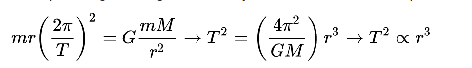
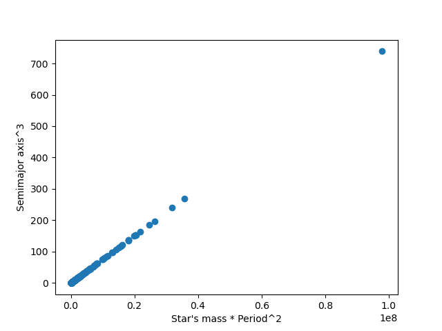
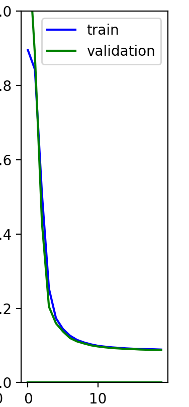
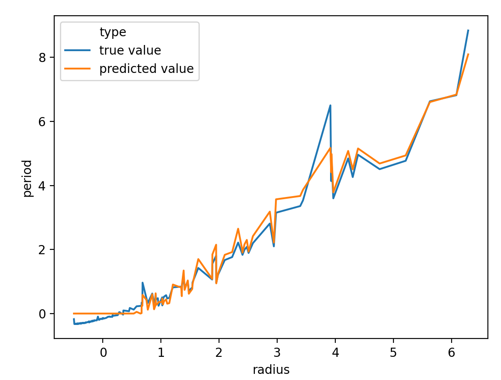

# AIFriendly-exoplanets
AIFriendly learns the period based on the values for radio and the mass of the associated star

<b>STATING THE PROBLEM</b>
<i>The "famous" Kepler's third law states a mass-dependent proportionality. 

<b>THE DATABASE</b> 
<i><a link="http://exoplanets.org/">The Exoplanets Database (Harvard?)</a> has info about ~400 parameters for ~5k exoplanets. 
Not all of them are physical tho. We filtered it and kept the onse that weren't vettoed by the organization AND also had info about the associated star's mass. 
The remaining dataset was then of 2.5k planets.</i>

<b>AI-FRIENDLY WAS USED AS A REGRESSOR</b> 
<i>1.8k planets were used for training 
0.4k planets were used for validation 
0.4k planets were used for testing </i>

<b>THE RESULTS</b> 
AI-Friendly was an excellent regressor. 
There might be a lot of ways to formulate a classification problem; we should pick one and show that AI-Friendly can do that too.
As the regression problem was solved, we have absolute certainty the classification will be solved too.

